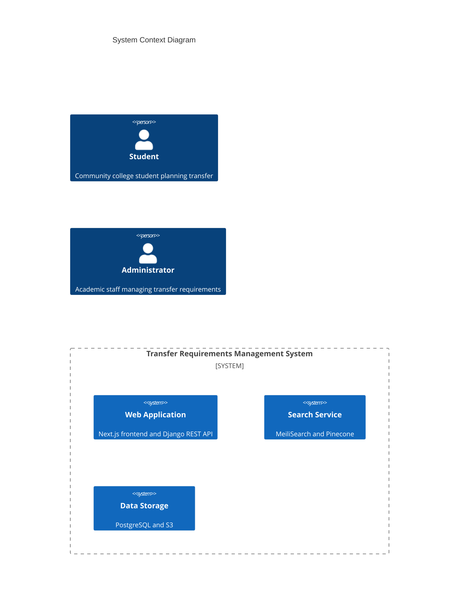

# Transfer Requirements Management System

[](https://github.com/org/transfer-requirements-system/actions)
[](https://github.com/org/transfer-requirements-system/releases)
[](LICENSE)
[](https://github.com/org/transfer-requirements-system/security)
[](https://transfer-requirements-system.readthedocs.io/)

A comprehensive web-based platform for managing course transfer requirements between California community colleges and 4-year institutions. The system streamlines and automates the complex process of maintaining accurate, accessible transfer pathways through automated requirement parsing, real-time validation, and intuitive interfaces.

## Quick Start

```bash
# Clone the repository
git clone https://github.com/org/transfer-requirements-system.git
cd transfer-requirements-system

# Configure environment
cp .env.example .env

# Start development environment
docker-compose up -d

# Verify installation
curl http://localhost:3000/health
```

## Project Overview

The Transfer Requirements Management System addresses critical challenges in higher education transfer pathways:

- **Automated Processing**: Reduces administrative overhead by 70% through intelligent requirement parsing
- **Real-time Validation**: Ensures 99.99% accuracy in transfer requirement validation
- **Scalable Platform**: Supports 2.1 million California community college students
- **Enterprise Integration**: Seamlessly connects with student information systems and course catalogs

### Key Features

- 🔄 Automated transfer requirement parsing and validation
- 🔍 Real-time course validation engine
- 📚 Version-controlled requirement management
- 🔎 Multi-institution search capabilities
- 📊 Progress tracking and notifications
- ⚡ Administrative workflows and approvals
- 📝 Student planning tools

## Architecture

### Technology Stack

- **Frontend**: Next.js 13+ with ShadcnUI components
- **Backend**: Django REST Framework
- **Database**: PostgreSQL 14+ with AWS RDS
- **Search**: MeiliSearch and Pinecone
- **Infrastructure**: AWS Cloud Services

### System Components



## Development Setup

### Prerequisites

- Docker 24+
- Node.js 18+
- Python 3.11+
- AWS CLI 2+
- Terraform 1.5+

### Local Development

```bash
# Start development environment
docker-compose up -d

# Run frontend development server
cd src/web
npm install
npm run dev

# Run backend development server
cd src/backend
python -m venv venv
source venv/bin/activate
pip install -r requirements.txt
python manage.py runserver
```

### Testing

```bash
# Frontend tests
cd src/web
npm run test

# Backend tests
cd src/backend
pytest

# End-to-end tests
npm run cypress
```

## Deployment

### Infrastructure Provisioning

```bash
# Initialize Terraform
cd infrastructure/terraform
terraform init

# Plan deployment
terraform plan -out=tfplan

# Apply infrastructure changes
terraform apply tfplan
```

### Application Deployment

```bash
# Build and push Docker images
docker-compose build
docker-compose push

# Deploy to ECS
aws ecs update-service --cluster production --service api --force-new-deployment
aws ecs update-service --cluster production --service web --force-new-deployment
```

## Contributing

1. Fork the repository
2. Create a feature branch (`git checkout -b feature/amazing-feature`)
3. Commit your changes (`git commit -m 'feat: add amazing feature'`)
4. Push to the branch (`git push origin feature/amazing-feature`)
5. Open a Pull Request

### Code Style

- Frontend: ESLint + Prettier
- Backend: Black + isort
- Infrastructure: terraform fmt

## Security

### Reporting Security Issues

Please report security vulnerabilities to security@organization.com. Do not create public issues for security concerns.

### Security Measures

- 🔒 JWT-based authentication with refresh tokens
- 🛡️ Role-based access control (RBAC)
- 🔐 Field-level encryption for sensitive data
- 🛑 WAF protection and DDoS mitigation
- 📝 Comprehensive audit logging

## Troubleshooting

### Common Issues

1. **Docker Compose Errors**
   ```bash
   docker-compose down -v
   docker-compose up --build
   ```

2. **Database Migration Issues**
   ```bash
   python manage.py migrate --fake-initial
   python manage.py migrate
   ```

3. **Cache Issues**
   ```bash
   docker-compose restart redis
   ```

## Maintenance

- 📅 Weekly dependency updates via Dependabot
- 🔒 Daily security scans
- 📊 Continuous performance monitoring
- 💾 Weekly backup verification
- 📚 Documentation reviews

## License

This project is licensed under the MIT License - see the [LICENSE](LICENSE) file for details.

## Acknowledgments

- California Community College System
- University of California
- California State University System