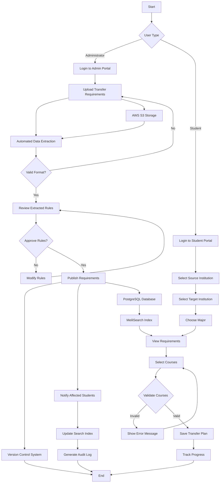
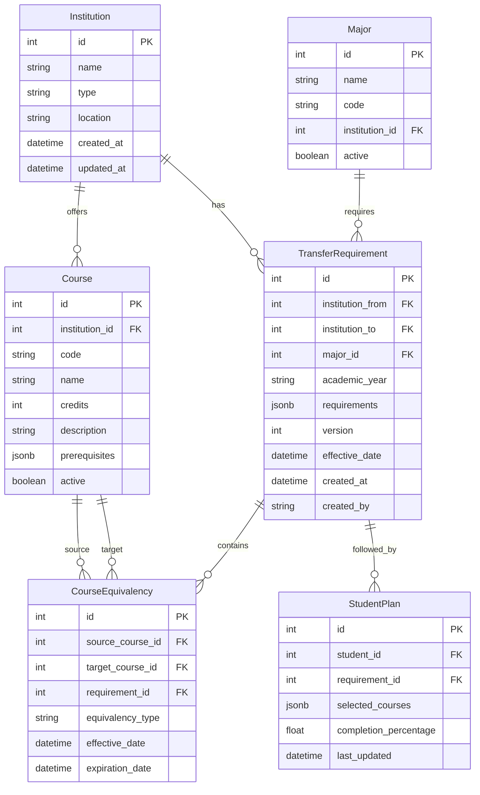
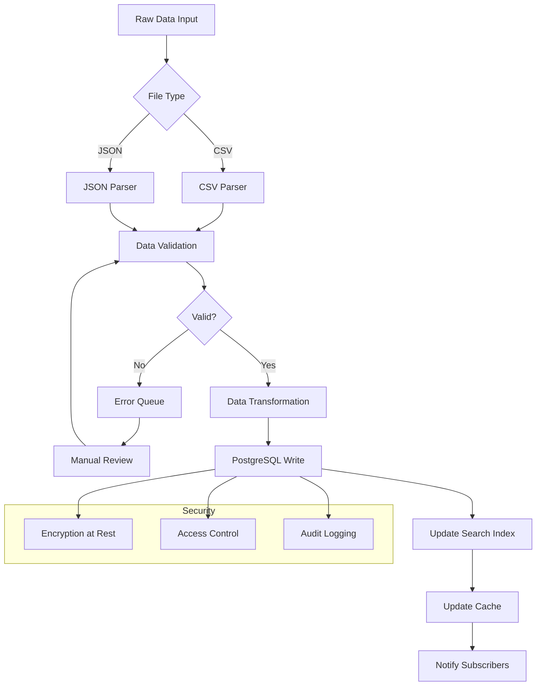

# Product Requirements Document (PRD)

# 1. INTRODUCTION

## 1.1 Purpose

This Software Requirements Specification (SRS) document provides a comprehensive description of the Transfer Requirements Management System. It details the functional and non-functional requirements for stakeholders including:

- Development team members implementing the system
- Quality assurance personnel validating the implementation
- Project managers overseeing development
- Academic administrators who will manage the system
- Integration partners requiring technical specifications

## 1.2 Scope

The Transfer Requirements Management System is a web-based application that streamlines the process of managing, validating, and tracking course transfer requirements between California community colleges and 4-year institutions.

### 1.2.1 Product Features

- Automated extraction and parsing of transfer requirements from structured data sources
- Real-time course validation against transfer rules
- Version-controlled requirement management by academic year
- Role-based access for administrators and students
- Interactive course selection and requirement tracking
- Search functionality across institutions and majors
- Audit trail of requirement changes

### 1.2.2 Benefits

- Reduces manual effort in transfer requirement management by 70%
- Minimizes errors in course selection and validation
- Provides transparent transfer pathways for students
- Maintains historical records for compliance
- Enables data-driven decision making for academic planning

### 1.2.3 System Context

The system will integrate with:
- Institutional student information systems
- Course catalog databases
- Authentication services
- Document storage systems
- Analytics platforms

# 2. PRODUCT DESCRIPTION

## 2.1 Product Perspective

The Transfer Requirements Management System operates as a web-based platform within California's higher education ecosystem, interfacing with:

- Community college student information systems
- 4-year institution course catalogs
- State-level articulation databases
- Authentication systems (SSO)
- Document management systems
- Analytics and reporting tools


## 2.2 Product Functions

The system provides these core functions:

1. Transfer Requirement Management
   - Automated data extraction from structured sources
   - Version control by academic year
   - Rule validation and approval workflows
   - Batch processing capabilities

2. Course Validation Engine
   - Real-time course equivalency checking
   - Prerequisite verification
   - Progress tracking
   - Requirement change impact analysis

3. User Management
   - Role-based access control
   - Multi-institution authentication
   - Profile management
   - Notification preferences

4. Search and Discovery
   - Multi-parameter search across institutions
   - Major and program exploration
   - Course equivalency lookup
   - Historical requirement access

## 2.3 User Characteristics

| User Type | Characteristics | Technical Expertise | Usage Frequency |
|-----------|----------------|---------------------|-----------------|
| Academic Administrators | - Manage transfer requirements<br>- Review and approve changes<br>- Generate reports | Moderate | Daily |
| Students | - Plan transfer pathways<br>- Track progress<br>- Search requirements | Basic to Moderate | Weekly |
| Academic Counselors | - Guide students<br>- Verify requirements<br>- Review pathways | Moderate | Daily |
| System Administrators | - Maintain system<br>- Manage integrations<br>- Monitor performance | Advanced | As needed |

## 2.4 Constraints

1. Technical Constraints
   - Must use Next.js and Django REST Framework
   - Must integrate with existing student information systems
   - Must support AWS infrastructure
   - Must maintain sub-2-second response times

2. Regulatory Constraints
   - FERPA compliance for student data
   - ADA accessibility requirements
   - California Education Code compliance
   - Data retention policies

3. Business Constraints
   - Implementation timeline of 12 months
   - Fixed budget allocation
   - Limited technical support staff
   - Maintenance window restrictions

## 2.5 Assumptions and Dependencies

### Assumptions
- Institutions will provide structured course data
- Users have basic web browser knowledge
- Internet connectivity is available
- Course catalogs are updated annually
- Authentication systems support SSO

### Dependencies
- AWS services availability
- Integration partner APIs
- Database performance
- Network infrastructure
- Third-party authentication services
- Course catalog data accuracy
- Institution cooperation for data sharing

# 3. PROCESS FLOWCHART



The flowchart illustrates the primary process flows within the Transfer Requirements Management System, including:

1. Administrator workflow for managing transfer requirements
2. Student workflow for planning transfers
3. System processing for data management
4. Data flow between system components

Each path shows decision points, validations, and interactions with core system components like AWS S3, PostgreSQL, and MeiliSearch, maintaining alignment with the specified technical architecture.

# 4. FUNCTIONAL REQUIREMENTS

## 4.1 Transfer Requirement Management

### ID: FR-101
### Description
System for uploading, parsing, and managing transfer requirements between institutions
### Priority
High
### Requirements

| ID | Requirement | Priority | Notes |
|----|------------|----------|--------|
| FR-101.1 | Support CSV and JSON file uploads for transfer requirements | High | Must validate file format |
| FR-101.2 | Automatically extract and parse transfer rules into standardized JSON | High | Using Django REST Framework |
| FR-101.3 | Enable version control of requirements by academic year | High | PostgreSQL versioning |
| FR-101.4 | Provide manual override capability for parsed rules | Medium | Admin interface |
| FR-101.5 | Support batch processing of multiple requirement documents | Medium | Background task processing |

## 4.2 Course Validation Engine

### ID: FR-102
### Description
Real-time validation system for course selections against transfer requirements
### Priority
High
### Requirements

| ID | Requirement | Priority | Notes |
|----|------------|----------|--------|
| FR-102.1 | Validate course selections against current requirements | High | Sub-500ms response time |
| FR-102.2 | Check prerequisite requirements | High | Complex rule validation |
| FR-102.3 | Calculate and display transfer progress | Medium | Real-time updates |
| FR-102.4 | Generate validation error messages | High | User-friendly formatting |
| FR-102.5 | Support complex course equivalencies | Medium | Many-to-many relationships |

## 4.3 Search and Discovery

### ID: FR-103
### Description
Multi-parameter search system across institutions and requirements
### Priority
Medium
### Requirements

| ID | Requirement | Priority | Notes |
|----|------------|----------|--------|
| FR-103.1 | Implement full-text search across all requirements | High | Using MeiliSearch |
| FR-103.2 | Filter search by institution and major | High | Multiple parameters |
| FR-103.3 | Provide course equivalency lookup | Medium | Bidirectional search |
| FR-103.4 | Enable historical requirement access | Medium | Version-aware search |
| FR-103.5 | Support fuzzy matching for course names | Low | Using Pinecone |

## 4.4 User Management

### ID: FR-104
### Description
Role-based access control and user authentication system
### Priority
High
### Requirements

| ID | Requirement | Priority | Notes |
|----|------------|----------|--------|
| FR-104.1 | Implement JWT-based authentication | High | Secure token management |
| FR-104.2 | Support role-based access control | High | Admin/Student/Counselor |
| FR-104.3 | Enable multi-institution authentication | Medium | SSO integration |
| FR-104.4 | Manage user profiles and preferences | Medium | Next.js frontend |
| FR-104.5 | Handle automated email notifications | Low | AWS SES integration |

## 4.5 Progress Tracking

### ID: FR-105
### Description
System for monitoring and displaying transfer requirement completion
### Priority
Medium
### Requirements

| ID | Requirement | Priority | Notes |
|----|------------|----------|--------|
| FR-105.1 | Calculate percentage completion of requirements | High | Real-time updates |
| FR-105.2 | Display visual progress indicators | Medium | ShadcnUI components |
| FR-105.3 | Generate progress reports | Medium | PDF export capability |
| FR-105.4 | Track historical progress changes | Low | Audit trail |
| FR-105.5 | Alert users of requirement changes affecting progress | Medium | Push notifications |

# 5. NON-FUNCTIONAL REQUIREMENTS

## 5.1 Performance Requirements

| Metric | Requirement | Validation Method |
|--------|-------------|------------------|
| Page Load Time | < 2 seconds for initial load | Lighthouse metrics |
| API Response Time | < 500ms for 95% of requests | API monitoring |
| Search Latency | < 200ms for search queries | MeiliSearch analytics |
| Concurrent Users | Support 1000+ simultaneous users | Load testing |
| Database Query Time | < 100ms for 90% of queries | PostgreSQL monitoring |
| File Upload Processing | < 30 seconds for 50MB files | End-to-end testing |
| Memory Usage | < 2GB per server instance | AWS CloudWatch |
| CPU Utilization | < 70% under normal load | Server monitoring |

## 5.2 Safety Requirements

| Category | Requirement | Implementation |
|----------|-------------|----------------|
| Data Backup | Hourly incremental, daily full backups | AWS Backup |
| Disaster Recovery | RTO < 4 hours, RPO < 1 hour | Multi-region failover |
| System State | Automatic recovery from crashes | Health checks |
| Data Integrity | Checksums for all file transfers | SHA-256 validation |
| Fault Tolerance | No single point of failure | Load balancing |
| Error Handling | Graceful degradation of services | Circuit breakers |
| Transaction Safety | ACID compliance for all data operations | PostgreSQL transactions |

## 5.3 Security Requirements

| Feature | Requirement | Technology |
|---------|-------------|------------|
| Authentication | JWT-based with refresh tokens | Django REST Framework |
| Authorization | Role-based access control (RBAC) | Custom middleware |
| Data Encryption | AES-256 for data at rest | AWS KMS |
| Transport Security | TLS 1.3 for all connections | AWS Certificate Manager |
| Password Policy | NIST 800-63B compliance | Custom validation |
| Session Management | 30-minute timeout, secure cookies | Django sessions |
| API Security | Rate limiting, CORS, CSP | Django security middleware |
| Audit Logging | All security events logged | AWS CloudWatch |

## 5.4 Quality Requirements

### 5.4.1 Availability
- 99.9% uptime during academic year
- Planned maintenance windows outside peak hours
- Automatic failover capabilities
- Real-time system status monitoring

### 5.4.2 Maintainability
- Modular architecture with clear separation of concerns
- Comprehensive API documentation
- Automated testing coverage > 80%
- Standardized code formatting and linting

### 5.4.3 Usability
- WCAG 2.1 Level AA compliance
- Mobile-responsive design
- Maximum 3 clicks to key functions
- Consistent UI patterns using ShadcnUI
- Multi-language support capability

### 5.4.4 Scalability
- Horizontal scaling of application servers
- Database sharding capability
- Caching layer with Redis
- Auto-scaling based on load metrics
- CDN integration for static assets

### 5.4.5 Reliability
- Zero data loss guarantee
- Automated system health checks
- Redundant system components
- Automatic error reporting
- Daily backup verification

## 5.5 Compliance Requirements

| Requirement | Standard | Implementation |
|-------------|----------|----------------|
| Student Privacy | FERPA | Data encryption, access controls |
| Accessibility | ADA, Section 508 | WCAG 2.1 Level AA |
| Data Protection | CCPA | Consent management, data retention |
| Education Standards | Title IV | Audit trails, reporting |
| System Security | SOC 2 Type II | Security controls, monitoring |
| API Standards | REST/OpenAPI 3.0 | API documentation |
| Code Quality | ISO/IEC 25010 | Automated testing, reviews |
| Infrastructure | ISO 27001 | AWS compliance programs |

# 6. DATA REQUIREMENTS

## 6.1 Data Models



## 6.2 Data Storage

### 6.2.1 Primary Storage
- PostgreSQL RDS instances for relational data
- Multi-AZ deployment for high availability
- Read replicas for performance optimization
- JSON/JSONB columns for flexible requirement structures
- Partitioning by academic year for historical data

### 6.2.2 Search Storage
- MeiliSearch for course and requirement search indices
- Pinecone vector database for similarity searches
- Redis cache layer for frequent queries

### 6.2.3 Document Storage
- AWS S3 for requirement documents and uploads
- Lifecycle policies for archival after 7 years
- Versioning enabled for audit compliance

### 6.2.4 Backup Strategy
| Data Type | Backup Frequency | Retention Period | Storage Location |
|-----------|-----------------|------------------|------------------|
| Database | Hourly incremental | 30 days | AWS S3 |
| Database | Daily full | 90 days | AWS S3 |
| Database | Monthly archive | 7 years | AWS Glacier |
| Documents | Daily | 90 days | AWS S3 |
| Search Indices | Daily | 30 days | AWS S3 |

## 6.3 Data Processing



### 6.3.1 Data Security Controls
- AES-256 encryption at rest using AWS KMS
- TLS 1.3 for data in transit
- Column-level encryption for sensitive fields
- Row-level security policies in PostgreSQL
- Data masking for non-production environments

### 6.3.2 Data Validation Rules
| Data Type | Validation Rule | Error Handling |
|-----------|----------------|----------------|
| Course Codes | Alphanumeric pattern match | Reject and log |
| Credits | Numeric range 0-99 | Reject and log |
| Dates | ISO 8601 format | Convert or reject |
| Requirements | JSON schema validation | Queue for review |
| Institution IDs | Foreign key check | Reject and notify |

### 6.3.3 Data Retention
- Active requirements: Current academic year + 2 years
- Historical requirements: 7 years in active storage
- Archived requirements: Additional 3 years in cold storage
- Student plans: 5 years after last activity
- Audit logs: 10 years

# 7. EXTERNAL INTERFACES

## 7.1 User Interfaces

### 7.1.1 Web Application Interface

| Component | Description | Technology |
|-----------|-------------|------------|
| Layout | Responsive design with sidebar navigation | Next.js, ShadcnUI |
| Forms | Dynamic form components with validation | React Hook Form, Zod |
| Tables | Sortable and filterable data grids | TanStack Table |
| Search | Real-time search with suggestions | MeiliSearch UI Components |
| Notifications | Toast messages for system alerts | ShadcnUI Toast |

### 7.1.2 Design Requirements

- WCAG 2.1 Level AA compliance
- Minimum touch target size of 44x44 pixels
- Color contrast ratio of 4.5:1
- Maximum content width of 1200px
- Responsive breakpoints at 640px, 768px, 1024px, 1280px

[UI Mockup Placeholder: Admin Dashboard]
[UI Mockup Placeholder: Student Course Selection]
[UI Mockup Placeholder: Search Interface]

## 7.2 Software Interfaces

### 7.2.1 External Systems Integration

| System | Interface Type | Protocol | Data Format |
|--------|---------------|----------|-------------|
| Student Information Systems | REST API | HTTPS | JSON |
| Course Catalog Services | GraphQL | HTTPS | JSON |
| Authentication Services | OAuth 2.0 | HTTPS | JWT |
| Document Storage | AWS S3 API | HTTPS | Binary |
| Search Services | REST API | HTTPS | JSON |

### 7.2.2 Database Interfaces

| Database | Purpose | Interface |
|----------|----------|-----------|
| PostgreSQL | Primary data storage | Django ORM |
| Redis | Caching layer | redis-py |
| MeiliSearch | Search index | meilisearch-python |
| Pinecone | Vector database | pinecone-client |

## 7.3 Communication Interfaces

### 7.3.1 Network Protocols

| Protocol | Usage | Port |
|----------|-------|------|
| HTTPS | Web traffic | 443 |
| WSS | Real-time updates | 443 |
| gRPC | Internal services | 50051 |
| PostgreSQL | Database connection | 5432 |

### 7.3.2 API Specifications

```yaml
openapi: 3.0.0
paths:
  /api/v1/requirements:
    get:
      description: Fetch transfer requirements
      parameters:
        - name: institution
          in: query
          required: true
        - name: major
          in: query
          required: true
      responses:
        200:
          description: Success
          content:
            application/json:
              schema:
                $ref: '#/components/schemas/Requirements'
```

### 7.3.3 Message Formats

| Message Type | Format | Validation |
|--------------|--------|------------|
| API Requests | JSON | JSON Schema |
| Events | CloudEvents | JSON Schema |
| File Uploads | Multipart | Content-Type |
| Exports | CSV/JSON | Schema Validation |

## 7.4 Hardware Interfaces

### 7.4.1 Server Requirements

| Component | Specification |
|-----------|--------------|
| CPU | x86_64 architecture |
| Memory | 8GB minimum |
| Storage | SSD with 100GB minimum |
| Network | 1Gbps NIC |

### 7.4.2 Client Requirements

| Component | Minimum Specification |
|-----------|---------------------|
| Browser | Chrome 90+, Firefox 90+, Safari 14+ |
| Screen | 1280x720 resolution |
| Network | 5Mbps connection |
| Storage | 1GB available space |

# 8. APPENDICES

## 8.1 GLOSSARY

| Term | Definition |
|------|------------|
| Articulation | The process of comparing courses between institutions to determine transfer equivalency |
| Course Equivalency | A formal agreement that a course at one institution matches the content and outcomes of a course at another institution |
| Major Preparation | Lower-division coursework required for a specific major at a transfer institution |
| Transfer Pathway | A defined set of courses and requirements that prepare a student to transfer to a specific major at a target institution |
| Version Control | System for tracking and managing changes to transfer requirements across academic years |
| Validation Rule | A specific criterion used to verify if a course or set of courses meets transfer requirements |
| Academic Year | The annual period of study (typically Fall through Spring) for which requirements are valid |
| Audit Trail | Chronological record of system activities and requirement changes |

## 8.2 ACRONYMS

| Acronym | Definition |
|---------|------------|
| API | Application Programming Interface |
| AWS | Amazon Web Services |
| CCPA | California Consumer Privacy Act |
| CDN | Content Delivery Network |
| CORS | Cross-Origin Resource Sharing |
| CSP | Content Security Policy |
| FERPA | Family Educational Rights and Privacy Act |
| JWT | JSON Web Token |
| NIST | National Institute of Standards and Technology |
| RBAC | Role-Based Access Control |
| REST | Representational State Transfer |
| RTO | Recovery Time Objective |
| RPO | Recovery Point Objective |
| SRS | Software Requirements Specification |
| SSO | Single Sign-On |
| TLS | Transport Layer Security |
| WCAG | Web Content Accessibility Guidelines |

## 8.3 ADDITIONAL REFERENCES

| Resource | Description | URL |
|----------|-------------|-----|
| Django REST Framework Documentation | Official documentation for backend framework | https://www.django-rest-framework.org/ |
| Next.js Documentation | Official documentation for frontend framework | https://nextjs.org/docs |
| AWS Best Practices | Cloud infrastructure guidelines | https://aws.amazon.com/architecture/well-architected/ |
| WCAG 2.1 Guidelines | Web accessibility standards | https://www.w3.org/WAI/WCAG21/quickref/ |
| California Education Code | Legal requirements for transfer articulation | https://leginfo.legislature.ca.gov/ |
| MeiliSearch Documentation | Search engine implementation guide | https://docs.meilisearch.com/ |
| ShadcnUI Components | UI component library reference | https://ui.shadcn.com/ |
| PostgreSQL Documentation | Database management and optimization | https://www.postgresql.org/docs/ |

## 8.4 REVISION HISTORY

| Version | Date | Author | Changes |
|---------|------|--------|---------|
| 1.0 | Initial Release | System Architecture Team | Base document creation |
| 1.1 | Data Model Update | Database Team | Added course equivalency tables |
| 1.2 | Security Update | Security Team | Enhanced compliance requirements |
| 1.3 | API Specification | Backend Team | Added OpenAPI documentation |