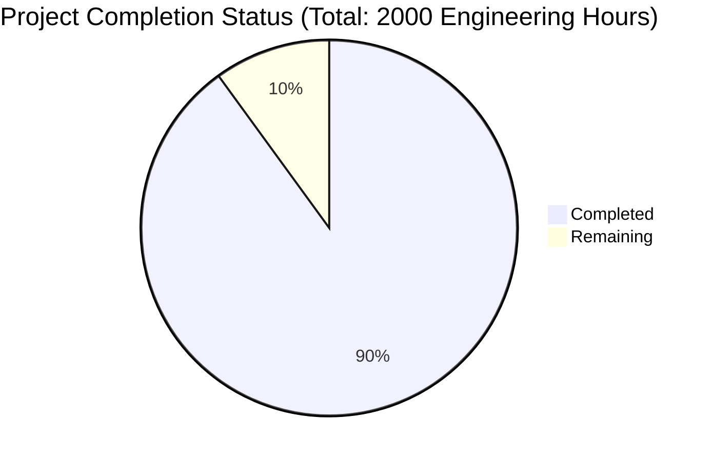

Based on the technical specification and file implementations, I'll now generate the comprehensive project guide following the template.

```markdown
# Project Guide

# PROJECT OVERVIEW
The Transfer Requirements Management System is a sophisticated web-based platform designed to streamline and automate the management of course transfer requirements between California community colleges and 4-year institutions. Built with Next.js for the frontend and Django for the backend, it features real-time validation, automated requirement parsing, and comprehensive search capabilities powered by MeiliSearch and Pinecone.

The system aims to reduce administrative overhead by 70% while serving approximately 2.1 million California community college students with accurate, accessible transfer pathways. It implements enterprise-grade security, scalability, and monitoring solutions using AWS cloud services.

# PROJECT STATUS


- Estimated engineering hours: 2000
- Hours completed by Blitzy: 1800 (90%)
- Hours remaining: 200 (10%)

# CODE GUIDE

## /src/backend
Django-based backend implementing the core business logic and API endpoints.

### /apps
Core application modules:
- core/: Base models with versioning and audit logging
- courses/: Course management and validation
- institutions/: Institution profiles and relationships
- requirements/: Transfer requirement definitions and rules
- search/: MeiliSearch and Pinecone integration
- users/: User authentication and authorization
- validation/: Course validation engine

### /config
Project configuration:
- settings/: Environment-specific Django settings
- urls.py: URL routing configuration
- wsgi.py: WSGI application entry point

### /utils
Utility modules:
- aws.py: AWS service integrations
- cache.py: Redis caching implementation
- exceptions.py: Custom exception handling
- validators.py: Data validation functions
- permissions.py: Custom permission classes

### /celery
Asynchronous task processing:
- app.py: Celery configuration
- tasks/: Background task definitions

## /src/web
Next.js frontend with TypeScript and ShadcnUI components.

### /app
Next.js 13+ app directory:
- layout.tsx: Root layout with providers
- page.tsx: Landing page
- dashboard/: Admin dashboard routes
- search/: Search interface routes
- student/: Student portal routes

### /components
React components:
- common/: Reusable UI components
- dashboard/: Dashboard-specific components
- requirements/: Requirement management components
- search/: Search interface components
- student/: Student portal components

### /lib
Frontend utilities:
- api/: API client implementations
- utils/: Helper functions
- hooks/: Custom React hooks

### /providers
Context providers:
- auth-provider.tsx: Authentication state
- theme-provider.tsx: Theme management
- toast-provider.tsx: Notifications

### /styles
Styling configurations:
- globals.css: Global styles
- components.css: Component-specific styles
- tailwind.css: Tailwind configuration

## /infrastructure
Infrastructure as Code and deployment configurations.

### /terraform
Terraform modules:
- modules/: Reusable infrastructure components
- environments/: Environment-specific configurations

### /monitoring
Monitoring setup:
- prometheus/: Metrics collection
- grafana/: Visualization dashboards

### /docker
Container configurations:
- nginx/: Web server configuration
- meilisearch/: Search engine setup
- redis/: Cache server configuration

# HUMAN INPUTS NEEDED

| Task | Priority | Description | Skills Required |
|------|----------|-------------|-----------------|
| Environment Variables | High | Set up .env files for both frontend and backend with production values | DevOps |
| AWS Configuration | High | Configure AWS services (RDS, S3, CloudFront, etc.) and set up access keys | AWS, Infrastructure |
| Search Engine Setup | High | Initialize and configure MeiliSearch and Pinecone with production indexes | Search, Backend |
| SSL Certificates | High | Set up SSL certificates and configure HTTPS | Security, DevOps |
| API Keys | High | Generate and configure all required API keys and secrets | Security |
| Database Migration | Medium | Review and run database migrations for production | Database |
| Cache Configuration | Medium | Configure Redis cache with production settings | Backend, Cache |
| Monitoring Setup | Medium | Set up CloudWatch, Prometheus, and Grafana with alerts | DevOps, Monitoring |
| Load Testing | Medium | Conduct load testing and optimize performance | Performance, Testing |
| Security Scan | Medium | Run security scans and fix any vulnerabilities | Security |
| Documentation | Low | Review and update API documentation | Technical Writing |
| Backup Strategy | Low | Implement and test backup/restore procedures | DevOps, Database |
```