# Technical Specifications

# 1. INTRODUCTION

## 1.1 EXECUTIVE SUMMARY

The Transfer Requirements Management System is a comprehensive web-based platform designed to streamline and automate the complex process of managing course transfer requirements between California community colleges and 4-year institutions. The system addresses the critical challenge of maintaining accurate, accessible transfer pathways by providing automated requirement parsing, real-time validation, and intuitive interfaces for both administrators and students.

This solution targets the inefficiencies and error-prone nature of manual transfer requirement management, promising to reduce administrative overhead by 70% while significantly improving the accuracy and transparency of transfer pathways for approximately 2.1 million California community college students.

## 1.2 SYSTEM OVERVIEW

### Project Context

| Aspect | Description |
| --- | --- |
| Market Position | Primary transfer requirement management system for California higher education institutions |
| Current Limitations | Manual processes, fragmented data sources, delayed requirement updates |
| Enterprise Integration | Interfaces with student information systems, course catalogs, and authentication services |

### High-Level Description

| Component | Implementation |
| --- | --- |
| Frontend Architecture | Next.js with ShadcnUI components |
| Backend Services | Django REST Framework |
| Data Storage | PostgreSQL with AWS RDS |
| Search Capabilities | MeiliSearch and Pinecone |
| Infrastructure | AWS Cloud Services |

### Success Criteria

| Metric | Target |
| --- | --- |
| Requirement Processing Time | \< 24 hours from submission to publication |
| System Availability | 99.9% uptime during academic year |
| User Adoption | 80% of target institutions within 12 months |
| Data Accuracy | 99.99% accuracy in transfer requirement validation |

## 1.3 SCOPE

### In-Scope Elements

#### Core Features and Functionalities

- Automated transfer requirement parsing and validation
- Real-time course validation engine
- Version-controlled requirement management
- Multi-institution search capabilities
- Progress tracking and notifications
- Administrative workflows and approvals
- Student planning tools

#### Implementation Boundaries

| Boundary Type | Coverage |
| --- | --- |
| Geographic | California higher education institutions |
| User Groups | Administrators, students, academic counselors |
| Data Domains | Course catalogs, transfer requirements, student plans |
| Time Scope | Current academic year plus 7-year history |

### Out-of-Scope Elements

- Direct student registration functionality
- Financial aid processing
- Transcript evaluation services
- Non-California institution requirements
- Mobile application development (Phase 2)
- Real-time integration with student information systems
- Degree audit functionality
- International transfer requirements

# 2. SYSTEM ARCHITECTURE

## 2.1 High-Level Architecture

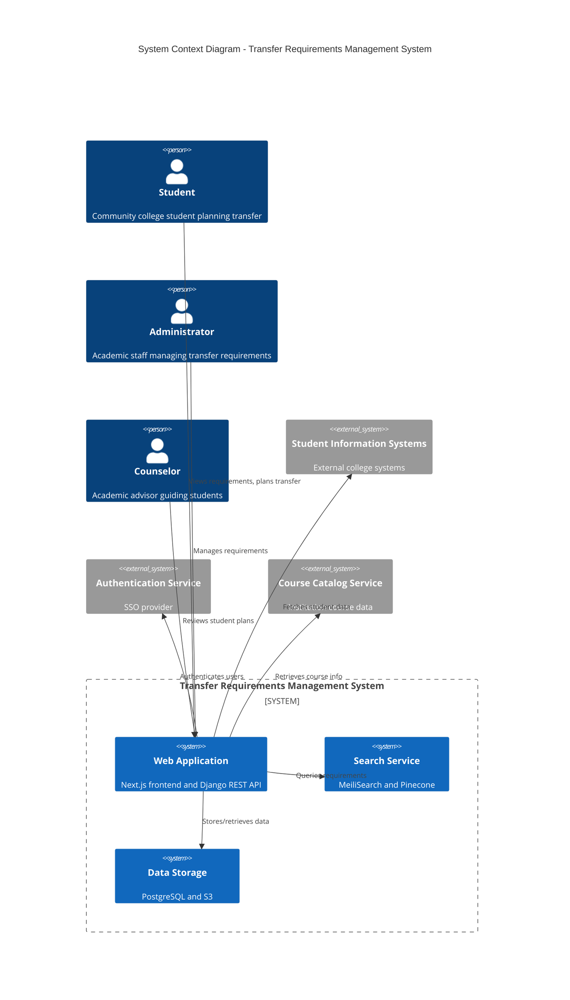
```mermaid
C4Context
    title System Context Diagram - Transfer Requirements Management System

    Person(student, "Student", "Community college student planning transfer")
    Person(admin, "Administrator", "Academic staff managing transfer requirements")
    Person(counselor, "Counselor", "Academic advisor guiding students")

    System_Boundary(trms, "Transfer Requirements Management System") {
        System(web, "Web Application", "Next.js frontend and Django REST API")
        System(search, "Search Service", "MeiliSearch and Pinecone")
        System(storage, "Data Storage", "PostgreSQL and S3")
    }

    System_Ext(sis, "Student Information Systems", "External college systems")
    System_Ext(auth, "Authentication Service", "SSO provider")
    System_Ext(catalog, "Course Catalog Service", "Institution course data")

    Rel(student, web, "Views requirements, plans transfer")
    Rel(admin, web, "Manages requirements")
    Rel(counselor, web, "Reviews student plans")
    
    Rel(web, search, "Queries requirements")
    Rel(web, storage, "Stores/retrieves data")
    Rel(web, auth, "Authenticates users")
    Rel(web, sis, "Fetches student data")
    Rel(web, catalog, "Retrieves course info")
```

## 2.2 Component Architecture

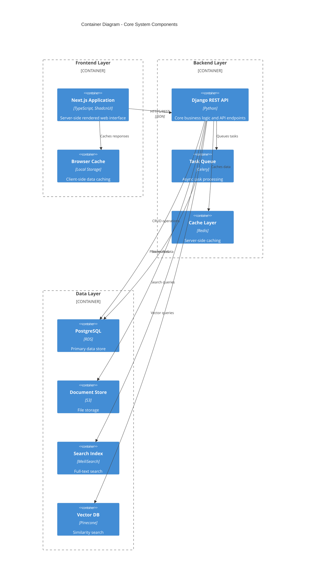
```mermaid
C4Container
    title Container Diagram - Core System Components

    Container_Boundary(frontend, "Frontend Layer") {
        Container(next, "Next.js Application", "TypeScript, ShadcnUI", "Server-side rendered web interface")
        Container(cache, "Browser Cache", "Local Storage", "Client-side data caching")
    }

    Container_Boundary(backend, "Backend Layer") {
        Container(api, "Django REST API", "Python", "Core business logic and API endpoints")
        Container(celery, "Task Queue", "Celery", "Async task processing")
        Container(redis, "Cache Layer", "Redis", "Server-side caching")
    }

    Container_Boundary(data, "Data Layer") {
        Container(postgres, "PostgreSQL", "RDS", "Primary data store")
        Container(s3, "Document Store", "S3", "File storage")
        Container(meili, "Search Index", "MeiliSearch", "Full-text search")
        Container(pine, "Vector DB", "Pinecone", "Similarity search")
    }

    Rel(next, api, "HTTPS/REST", "JSON")
    Rel(next, cache, "Caches responses")
    Rel(api, redis, "Caches data")
    Rel(api, celery, "Queues tasks")
    Rel(celery, postgres, "Processes data")
    Rel(api, postgres, "CRUD operations")
    Rel(api, s3, "Stores files")
    Rel(api, meili, "Search queries")
    Rel(api, pine, "Vector queries")
```

## 2.3 Component Details

### 2.3.1 Frontend Components

| Component | Technology | Purpose | Scaling Strategy |
| --- | --- | --- | --- |
| Web UI | Next.js 13+ | Server-side rendered interface | Horizontal via AWS Amplify |
| State Management | React Context | Client-side state | Per-component basis |
| Form Handling | React Hook Form | User input management | Client-side validation |
| API Client | Axios | Backend communication | Request interceptors |
| UI Components | ShadcnUI | Consistent interface | Component library |

### 2.3.2 Backend Components

| Component | Technology | Purpose | Scaling Strategy |
| --- | --- | --- | --- |
| API Server | Django REST | Core business logic | Horizontal via ECS |
| Task Queue | Celery | Async processing | Worker pools |
| Cache Layer | Redis | Performance optimization | Cluster mode |
| Authentication | JWT | User security | Token-based |
| File Storage | S3 | Document management | Bucket policies |

### 2.3.3 Data Components

| Component | Technology | Purpose | Scaling Strategy |
| --- | --- | --- | --- |
| Database | PostgreSQL 14+ | Primary data store | Read replicas |
| Search Engine | MeiliSearch | Full-text search | Distributed clusters |
| Vector Search | Pinecone | Similarity matching | Managed service |
| Object Storage | S3 | File storage | Lifecycle policies |

## 2.4 Data Flow Architecture

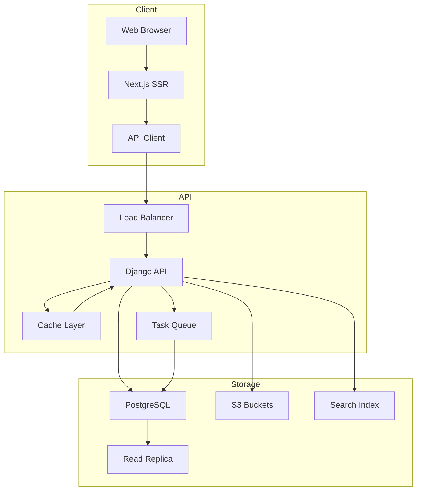
```mermaid
flowchart TD
    subgraph Client
        A[Web Browser] --> B[Next.js SSR]
        B --> C[API Client]
    end

    subgraph API
        D[Load Balancer] --> E[Django API]
        E --> F[Cache Layer]
        E --> G[Task Queue]
    end

    subgraph Storage
        H[PostgreSQL] --> I[Read Replica]
        J[S3 Buckets]
        K[Search Index]
    end

    C --> D
    E --> H
    E --> J
    E --> K
    G --> H
    F --> E
```

## 2.5 Deployment Architecture

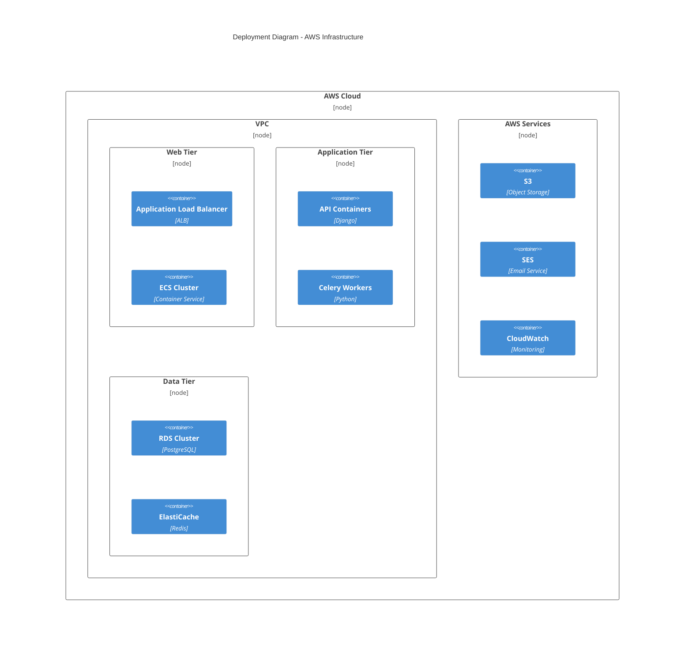
```mermaid
C4Deployment
    title Deployment Diagram - AWS Infrastructure

    Deployment_Node(aws, "AWS Cloud") {
        Deployment_Node(vpc, "VPC") {
            Deployment_Node(web, "Web Tier") {
                Container(alb, "Application Load Balancer", "ALB")
                Container(ecs, "ECS Cluster", "Container Service")
            }
            
            Deployment_Node(app, "Application Tier") {
                Container(api, "API Containers", "Django")
                Container(worker, "Celery Workers", "Python")
            }
            
            Deployment_Node(data, "Data Tier") {
                Container(rds, "RDS Cluster", "PostgreSQL")
                Container(elasticache, "ElastiCache", "Redis")
            }
        }
        
        Deployment_Node(services, "AWS Services") {
            Container(s3, "S3", "Object Storage")
            Container(ses, "SES", "Email Service")
            Container(cloudwatch, "CloudWatch", "Monitoring")
        }
    }
```

## 2.6 Cross-Cutting Concerns

### 2.6.1 Monitoring and Observability

| Aspect | Implementation | Tools |
| --- | --- | --- |
| Metrics | System and application metrics | CloudWatch, Prometheus |
| Logging | Structured JSON logs | CloudWatch Logs |
| Tracing | Distributed request tracing | AWS X-Ray |
| Alerting | Automated alert rules | CloudWatch Alarms |

### 2.6.2 Security Architecture

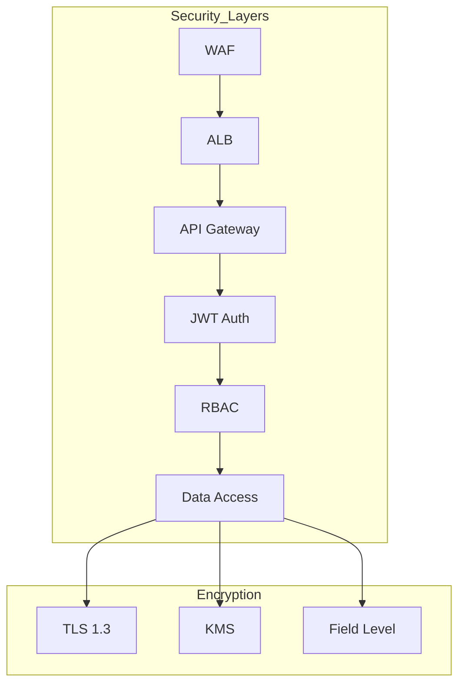
```mermaid
flowchart TD
    subgraph Security_Layers
        A[WAF] --> B[ALB]
        B --> C[API Gateway]
        C --> D[JWT Auth]
        D --> E[RBAC]
        E --> F[Data Access]
    end

    subgraph Encryption
        G[TLS 1.3]
        H[KMS]
        I[Field Level]
    end

    F --> G
    F --> H
    F --> I
```

### 2.6.3 Error Handling Strategy

| Error Type | Strategy | Implementation |
| --- | --- | --- |
| API Errors | Standard error responses | Django REST Framework |
| Validation | Client and server validation | Zod, Django validators |
| Network | Retry with exponential backoff | Axios interceptors |
| Database | Transaction management | Django transactions |
| Task Queue | Dead letter queues | Celery error handling |

### 2.6.4 Performance Requirements

| Metric | Target | Implementation |
| --- | --- | --- |
| Page Load | \< 2s | CDN, SSR optimization |
| API Response | \< 500ms | Caching, indexing |
| Search Latency | \< 200ms | MeiliSearch optimization |
| Database Queries | \< 100ms | Query optimization |
| File Operations | \< 5s | S3 transfer acceleration |

# 3. SYSTEM COMPONENTS ARCHITECTURE

## 3.1 USER INTERFACE DESIGN

### 3.1.1 Design Specifications

| Aspect | Requirement | Implementation |
| --- | --- | --- |
| Visual Hierarchy | 8-point grid system | ShadcnUI spacing utilities |
| Typography | System font stack with fallbacks | Tailwind typography plugin |
| Color System | WCAG 2.1 AA compliant palette | CSS custom properties |
| Responsive Design | Mobile-first, 5 breakpoints | Tailwind responsive classes |
| Accessibility | WCAG 2.1 Level AA | ARIA attributes, semantic HTML |
| Theme Support | Light/Dark modes | CSS variables, prefers-color-scheme |
| Internationalization | LTR/RTL support | CSS logical properties |

### 3.1.2 Component Library

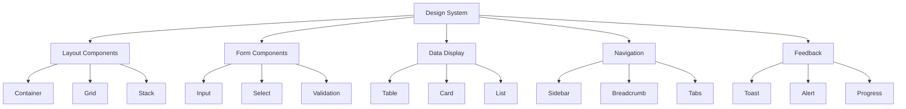
```mermaid
graph TD
    A[Design System] --> B[Layout Components]
    A --> C[Form Components]
    A --> D[Data Display]
    A --> E[Navigation]
    A --> F[Feedback]

    B --> B1[Container]
    B --> B2[Grid]
    B --> B3[Stack]

    C --> C1[Input]
    C --> C2[Select]
    C --> C3[Validation]

    D --> D1[Table]
    D --> D2[Card]
    D --> D3[List]

    E --> E1[Sidebar]
    E --> E2[Breadcrumb]
    E --> E3[Tabs]

    F --> F1[Toast]
    F --> F2[Alert]
    F --> F3[Progress]
```

### 3.1.3 Critical User Flows

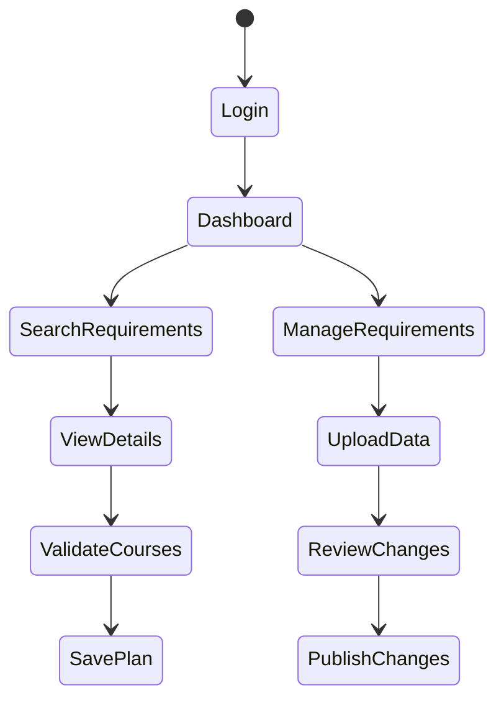
```mermaid
stateDiagram-v2
    [*] --> Login
    Login --> Dashboard
    Dashboard --> SearchRequirements
    Dashboard --> ManageRequirements
    
    SearchRequirements --> ViewDetails
    ViewDetails --> ValidateCourses
    ValidateCourses --> SavePlan
    
    ManageRequirements --> UploadData
    UploadData --> ReviewChanges
    ReviewChanges --> PublishChanges
```

## 3.2 DATABASE DESIGN

### 3.2.1 Schema Design

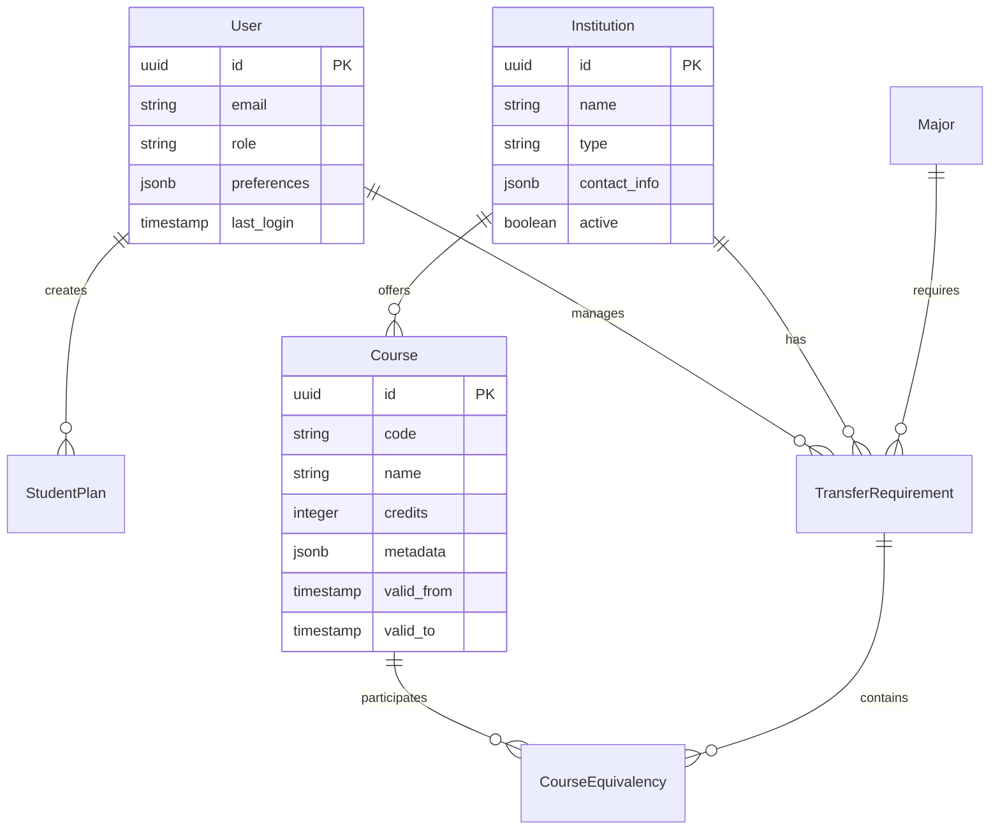
```mermaid
erDiagram
    User ||--o{ StudentPlan : creates
    User ||--o{ TransferRequirement : manages
    Institution ||--o{ Course : offers
    Institution ||--o{ TransferRequirement : has
    Course ||--o{ CourseEquivalency : participates
    TransferRequirement ||--o{ CourseEquivalency : contains
    Major ||--o{ TransferRequirement : requires
    
    User {
        uuid id PK
        string email
        string role
        jsonb preferences
        timestamp last_login
    }
    
    Institution {
        uuid id PK
        string name
        string type
        jsonb contact_info
        boolean active
    }
    
    Course {
        uuid id PK
        string code
        string name
        integer credits
        jsonb metadata
        timestamp valid_from
        timestamp valid_to
    }
```

### 3.2.2 Data Management Strategy

| Aspect | Strategy | Implementation |
| --- | --- | --- |
| Partitioning | By academic year | PostgreSQL table partitioning |
| Indexing | B-tree and GiST indexes | Automated index management |
| Versioning | Temporal tables | System-versioned tables |
| Archival | Rolling window retention | Automated archival jobs |
| Backup | Point-in-time recovery | WAL archiving to S3 |
| Encryption | Column-level encryption | AWS KMS integration |

### 3.2.3 Caching Strategy

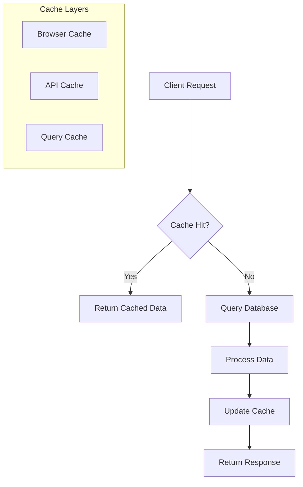
```mermaid
flowchart TD
    A[Client Request] --> B{Cache Hit?}
    B -->|Yes| C[Return Cached Data]
    B -->|No| D[Query Database]
    D --> E[Process Data]
    E --> F[Update Cache]
    F --> G[Return Response]
    
    subgraph Cache Layers
    H[Browser Cache]
    I[API Cache]
    J[Query Cache]
    end
```

## 3.3 API DESIGN

### 3.3.1 API Architecture

| Component | Specification | Implementation |
| --- | --- | --- |
| Protocol | REST over HTTPS | Django REST Framework |
| Authentication | JWT with refresh tokens | Simple JWT package |
| Authorization | Role-based with scopes | Custom permission classes |
| Rate Limiting | Tiered by user role | Django REST Framework throttling |
| Versioning | URI versioning | Custom router |
| Documentation | OpenAPI 3.0 | drf-spectacular |

### 3.3.2 Endpoint Specifications

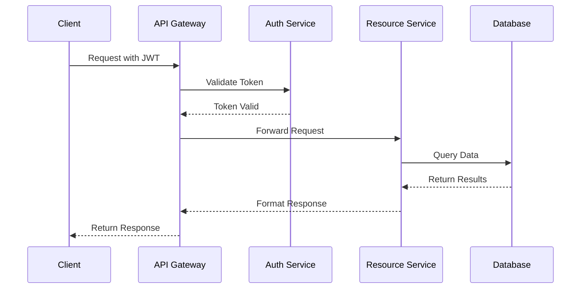
```mermaid
sequenceDiagram
    participant C as Client
    participant G as API Gateway
    participant A as Auth Service
    participant R as Resource Service
    participant D as Database

    C->>G: Request with JWT
    G->>A: Validate Token
    A-->>G: Token Valid
    G->>R: Forward Request
    R->>D: Query Data
    D-->>R: Return Results
    R-->>G: Format Response
    G-->>C: Return Response
```

### 3.3.3 Integration Patterns

| Pattern | Purpose | Implementation |
| --- | --- | --- |
| Circuit Breaker | Fault tolerance | Django Circuit Breaker |
| Retry | Transient failures | Celery retry policies |
| Throttling | Rate control | Token bucket algorithm |
| Caching | Performance | Redis cache backend |
| Logging | Observability | CloudWatch integration |
| Monitoring | Health checks | Custom middleware |

# 4. TECHNOLOGY STACK

## 4.1 PROGRAMMING LANGUAGES

| Platform | Language | Version | Justification |
| --- | --- | --- | --- |
| Backend | Python | 3.11+ | - Django ecosystem compatibility<br>- Strong data processing libraries<br>- Extensive ML/AI capabilities |
| Frontend | TypeScript | 5.0+ | - Type safety for large application<br>- Next.js native support<br>- Enhanced developer productivity |
| Database | SQL | PostgreSQL 14+ | - Complex query requirements<br>- JSONB support for flexible schemas<br>- Temporal table capabilities |
| Infrastructure | HCL | Terraform 1.5+ | - AWS infrastructure management<br>- Version controlled infrastructure<br>- Multi-environment support |

## 4.2 FRAMEWORKS & LIBRARIES

### Core Frameworks

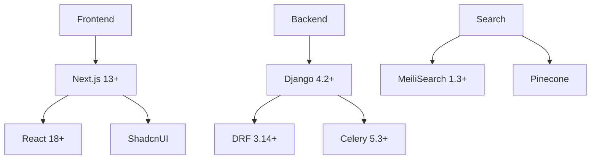
```mermaid
graph TD
    A[Frontend] --> B[Next.js 13+]
    B --> C[React 18+]
    B --> D[ShadcnUI]
    
    E[Backend] --> F[Django 4.2+]
    F --> G[DRF 3.14+]
    F --> H[Celery 5.3+]
    
    I[Search] --> J[MeiliSearch 1.3+]
    I --> K[Pinecone]
```

### Supporting Libraries

| Category | Library | Version | Purpose |
| --- | --- | --- | --- |
| Form Management | React Hook Form | 7.45+ | Complex form handling with validation |
| State Management | React Context | 18+ | Application state management |
| API Client | Axios | 1.4+ | HTTP client with interceptors |
| Task Queue | Celery | 5.3+ | Asynchronous task processing |
| Caching | Redis | 7.0+ | High-performance caching layer |
| Testing | Jest/PyTest | 29+/7+ | Comprehensive test coverage |

## 4.3 DATABASES & STORAGE

### Data Architecture

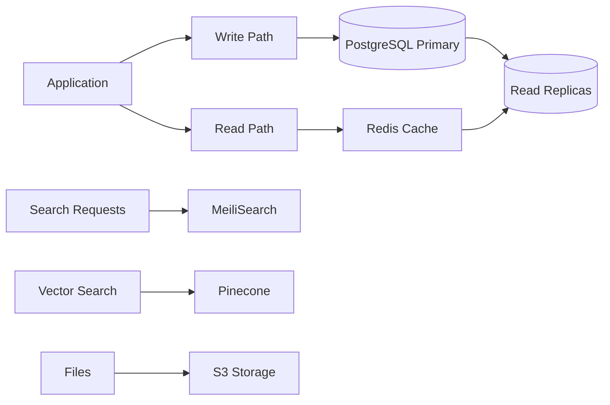
```mermaid
flowchart LR
    A[Application] --> B[Write Path]
    A --> C[Read Path]
    
    B --> D[(PostgreSQL Primary)]
    D --> E[(Read Replicas)]
    
    C --> F[Redis Cache]
    F --> E
    
    G[Search Requests] --> H[MeiliSearch]
    I[Vector Search] --> J[Pinecone]
    
    K[Files] --> L[S3 Storage]
```

### Storage Solutions

| Type | Technology | Purpose | Configuration |
| --- | --- | --- | --- |
| Primary Database | PostgreSQL 14+ | Relational data | Multi-AZ RDS |
| Cache Layer | Redis 7.0+ | Performance optimization | ElastiCache Cluster |
| Search Index | MeiliSearch 1.3+ | Full-text search | EC2 Instances |
| Vector Database | Pinecone | Similarity search | Managed Service |
| Object Storage | S3 | Document storage | Versioned buckets |

## 4.4 THIRD-PARTY SERVICES

| Service | Provider | Purpose | Integration |
| --- | --- | --- | --- |
| Authentication | AWS Cognito | User management | JWT-based auth |
| Email | AWS SES | Notifications | SMTP/API |
| Monitoring | CloudWatch | System metrics | AWS SDK |
| Logging | CloudWatch Logs | Centralized logging | AWS SDK |
| CDN | CloudFront | Content delivery | Edge locations |
| SSL/TLS | ACM | Security certificates | ALB integration |

## 4.5 DEVELOPMENT & DEPLOYMENT

### Development Pipeline

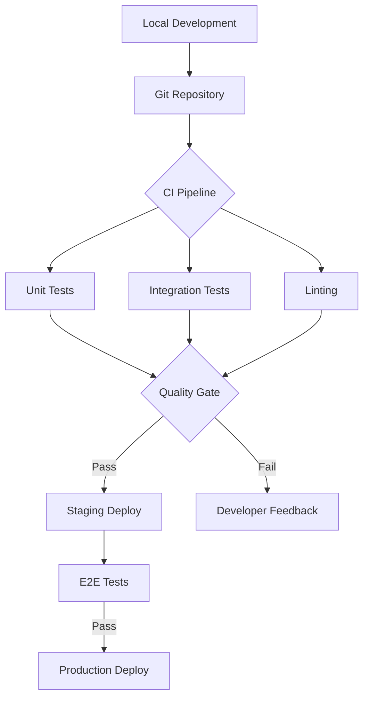
```mermaid
flowchart TD
    A[Local Development] --> B[Git Repository]
    B --> C{CI Pipeline}
    C --> D[Unit Tests]
    C --> E[Integration Tests]
    C --> F[Linting]
    
    D --> G{Quality Gate}
    E --> G
    F --> G
    
    G -->|Pass| H[Staging Deploy]
    H --> I[E2E Tests]
    I -->|Pass| J[Production Deploy]
    
    G -->|Fail| K[Developer Feedback]
```

### Environment Configuration

| Environment | Infrastructure | Purpose | Deployment |
| --- | --- | --- | --- |
| Development | Local Docker | Developer testing | Docker Compose |
| Staging | AWS ECS | Integration testing | GitHub Actions |
| Production | AWS ECS | Live system | GitHub Actions |
| DR | AWS ECS | Disaster recovery | Cross-region |

### Build Tools

| Tool | Version | Purpose |
| --- | --- | --- |
| Docker | 24+ | Containerization |
| GitHub Actions | N/A | CI/CD pipeline |
| Terraform | 1.5+ | Infrastructure as Code |
| npm/pip | Latest | Package management |
| ESLint/Black | Latest | Code formatting |

# 5. SYSTEM DESIGN

## 5.1 USER INTERFACE DESIGN

### 5.1.1 Layout Structure

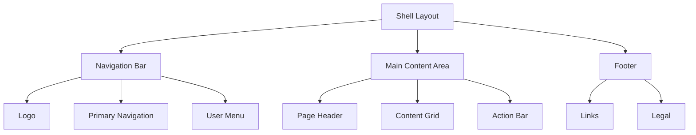
```mermaid
graph TD
    A[Shell Layout] --> B[Navigation Bar]
    A --> C[Main Content Area]
    A --> D[Footer]
    
    B --> B1[Logo]
    B --> B2[Primary Navigation]
    B --> B3[User Menu]
    
    C --> C1[Page Header]
    C --> C2[Content Grid]
    C --> C3[Action Bar]
    
    D --> D1[Links]
    D --> D2[Legal]
```

### 5.1.2 Core Components

| Component | Purpose | Implementation |
| --- | --- | --- |
| Navigation | Primary app navigation | ShadcnUI Navbar + Next.js routing |
| Search Bar | Global requirement search | Autocomplete with MeiliSearch |
| Data Grid | Requirement management | TanStack Table + ShadcnUI styling |
| Forms | Data input/editing | React Hook Form + Zod validation |
| Modals | Secondary actions | ShadcnUI Dialog components |

### 5.1.3 Page Layouts

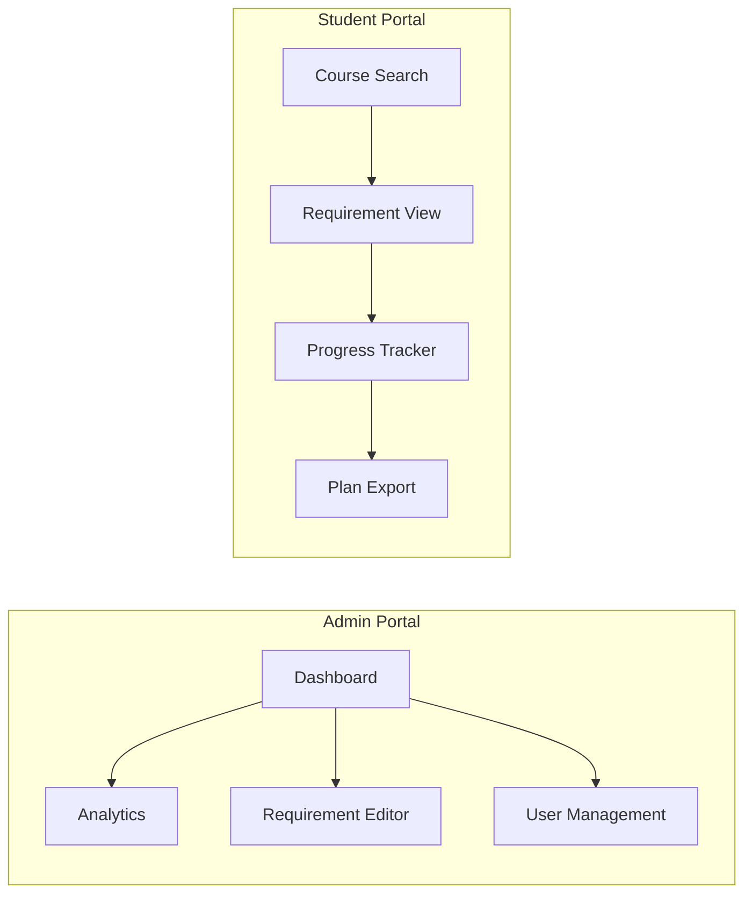
```mermaid
graph LR
    subgraph Admin Portal
        A1[Dashboard] --> A2[Analytics]
        A1 --> A3[Requirement Editor]
        A1 --> A4[User Management]
    end
    
    subgraph Student Portal
        B1[Course Search] --> B2[Requirement View]
        B2 --> B3[Progress Tracker]
        B3 --> B4[Plan Export]
    end
```

## 5.2 DATABASE DESIGN

### 5.2.1 Schema Design

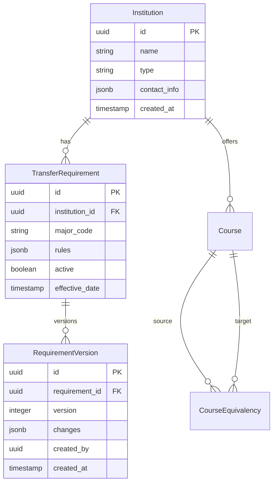
```mermaid
erDiagram
    Institution ||--o{ TransferRequirement : has
    Institution ||--o{ Course : offers
    TransferRequirement ||--o{ RequirementVersion : versions
    Course ||--o{ CourseEquivalency : source
    Course ||--o{ CourseEquivalency : target
    
    Institution {
        uuid id PK
        string name
        string type
        jsonb contact_info
        timestamp created_at
    }
    
    TransferRequirement {
        uuid id PK
        uuid institution_id FK
        string major_code
        jsonb rules
        boolean active
        timestamp effective_date
    }
    
    RequirementVersion {
        uuid id PK
        uuid requirement_id FK
        integer version
        jsonb changes
        uuid created_by
        timestamp created_at
    }
```

### 5.2.2 Indexing Strategy

| Table | Index Type | Columns | Purpose |
| --- | --- | --- | --- |
| TransferRequirement | B-tree | institution_id, major_code | Lookup optimization |
| Course | GiST | code, name | Full-text search |
| RequirementVersion | B-tree | requirement_id, version | Version queries |
| CourseEquivalency | Hash | source_id, target_id | Equivalency lookup |

### 5.2.3 Data Access Patterns

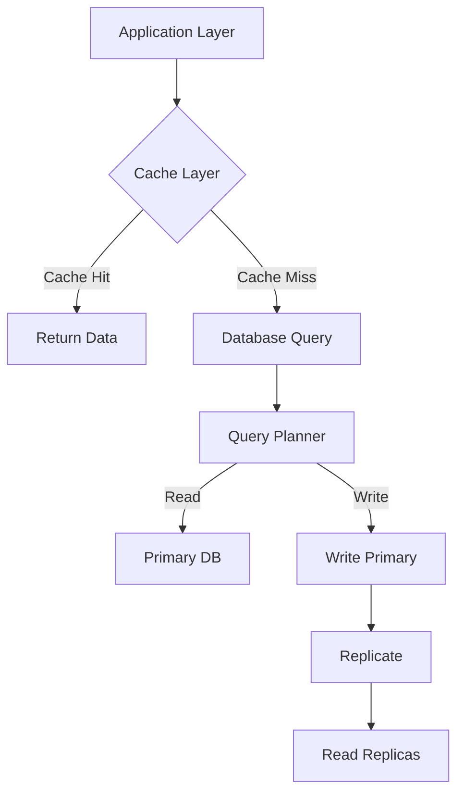
```mermaid
flowchart TD
    A[Application Layer] --> B{Cache Layer}
    B -->|Cache Hit| C[Return Data]
    B -->|Cache Miss| D[Database Query]
    D --> E[Query Planner]
    E -->|Read| F[Primary DB]
    E -->|Write| G[Write Primary]
    G --> H[Replicate]
    H --> I[Read Replicas]
```

## 5.3 API DESIGN

### 5.3.1 REST Endpoints

| Endpoint | Method | Purpose | Response |
| --- | --- | --- | --- |
| /api/v1/requirements | GET | List requirements | Paginated requirements |
| /api/v1/requirements | POST | Create requirement | New requirement |
| /api/v1/requirements/{id} | PUT | Update requirement | Updated requirement |
| /api/v1/courses | GET | Search courses | Course list |
| /api/v1/validation | POST | Validate courses | Validation result |

### 5.3.2 Authentication Flow

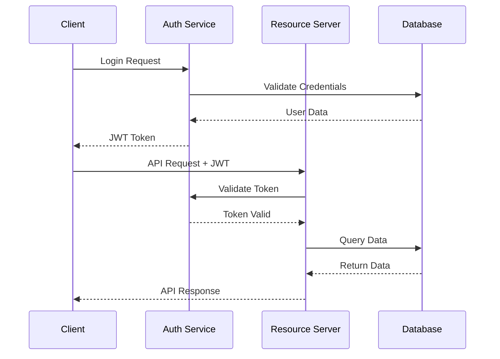
```mermaid
sequenceDiagram
    participant C as Client
    participant A as Auth Service
    participant R as Resource Server
    participant D as Database

    C->>A: Login Request
    A->>D: Validate Credentials
    D-->>A: User Data
    A-->>C: JWT Token
    C->>R: API Request + JWT
    R->>A: Validate Token
    A-->>R: Token Valid
    R->>D: Query Data
    D-->>R: Return Data
    R-->>C: API Response
```

### 5.3.3 Error Handling

| Error Type | HTTP Code | Response Format |
| --- | --- | --- |
| Validation Error | 400 | `{"errors": [{"field": "message"}]}` |
| Authentication | 401 | `{"error": "message"}` |
| Authorization | 403 | `{"error": "message"}` |
| Not Found | 404 | `{"error": "message"}` |
| Server Error | 500 | `{"error": "message"}` |

### 5.3.4 Rate Limiting

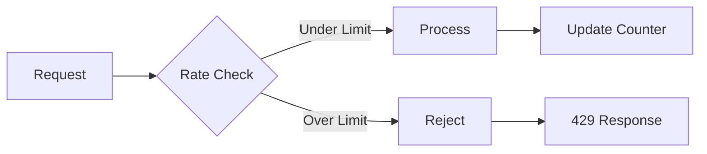
```mermaid
flowchart LR
    A[Request] --> B{Rate Check}
    B -->|Under Limit| C[Process]
    B -->|Over Limit| D[Reject]
    C --> E[Update Counter]
    D --> F[429 Response]
```

# 6. USER INTERFACE DESIGN

## 6.1 Design System

### 6.1.1 Component Legend

```
Icons:
[?] - Help/Information tooltip
[$] - Payment/Financial information
[i] - Information message
[+] - Add new item
[x] - Close/Delete item
[<] [>] - Navigation controls
[^] - Upload functionality
[#] - Dashboard/Menu
[@] - User profile
[!] - Warning/Alert
[=] - Settings menu
[*] - Favorite/Important

Interactive Elements:
[ ] - Checkbox
( ) - Radio button
[Button] - Clickable button
[...] - Text input field
[====] - Progress bar
[v] - Dropdown menu
```

### 6.1.2 Layout Grid

```
+------------------+------------------+------------------+
|     Mobile       |     Tablet       |     Desktop      |
|      320px       |      768px       |     1200px       |
+------------------+------------------+------------------+
| Single column    | Two columns      | Three columns    |
| Stack layout     | Grid layout      | Grid layout      |
| 16px margins     | 24px margins     | 32px margins     |
+------------------+------------------+------------------+
```

## 6.2 Core Screens

### 6.2.1 Administrator Dashboard

```
+--------------------------------------------------------+
|  [#] Transfer Requirements System       [@] Admin  [=]   |
+--------------------------------------------------------+
|                                                         |
|  +------------------+  +------------------+             |
|  | Active Rules     |  | Pending Reviews  |             |
|  | [====] 245       |  | [!] 12 waiting   |             |
|  +------------------+  +------------------+             |
|                                                         |
|  [Search Requirements...]                               |
|                                                         |
|  Recent Updates                                         |
|  +------------------------------------------------+    |
|  | Institution    | Major         | Status    |    |    |
|  |------------------------------------------------|    |
|  | UC Berkeley    | Computer Sci  | [*] Active |[x]|    |
|  | UCLA           | Biology       | [!] Review |[x]|    |
|  | Stanford       | Engineering   | [*] Active |[x]|    |
|  +------------------------------------------------+    |
|                                                         |
|  [+ Add New Requirement]                               |
+--------------------------------------------------------+
```

### 6.2.2 Student Course Planning

```
+--------------------------------------------------------+
|  [#] Transfer Planner                [@] Student  [?]   |
+--------------------------------------------------------+
|                                                         |
|  From: [v] Community College                            |
|  To:   [v] University                                   |
|  Major:[v] Computer Science                             |
|                                                         |
|  Progress: [=========>                ] 45%             |
|                                                         |
|  Required Courses:                                      |
|  +------------------------------------------------+    |
|  | [x] MATH 101 - Calculus I         | Complete   |    |
|  | [ ] MATH 102 - Calculus II        | Planned    |    |
|  | [ ] CS 101 - Intro Programming    | Missing    |    |
|  +------------------------------------------------+    |
|                                                         |
|  [Save Plan]              [Export PDF]                  |
+--------------------------------------------------------+
```

### 6.2.3 Requirement Editor

```
+--------------------------------------------------------+
|  [#] Edit Requirement                [@] Admin    [?]   |
+--------------------------------------------------------+
|                                                         |
|  Institution: [v] UC Berkeley                           |
|  Major: [v] Computer Science                            |
|  Year: [v] 2023-2024                                   |
|                                                         |
|  Course Requirements:                                   |
|  +------------------------------------------------+    |
|  | Course Code | Units | Prerequisites  | Actions  |    |
|  |------------------------------------------------|    |
|  | [...CS101]  | [3]   | [None]        | [x] [^] |    |
|  | [...CS102]  | [3]   | [...CS101]    | [x] [^] |    |
|  +------------------------------------------------+    |
|                                                         |
|  [+ Add Course]                                        |
|                                                         |
|  Validation Rules:                                      |
|  ( ) Must complete all courses                          |
|  ( ) Minimum unit requirement                           |
|  ( ) Custom rule set                                    |
|                                                         |
|  [Save Draft]            [Publish Requirement]          |
+--------------------------------------------------------+
```

### 6.2.4 Search Interface

```
+--------------------------------------------------------+
|  [#] Search Requirements             [@] User     [=]   |
+--------------------------------------------------------+
|                                                         |
|  [Search courses, majors, or institutions...]           |
|                                                         |
|  Filters:                     Results:                  |
|  +-------------------+       +----------------------+   |
|  | Institution Type: |       | Computer Science     |   |
|  | [x] UC System    |       | UC Berkeley          |   |
|  | [ ] CSU System   |       | Fall 2023            |   |
|  | [ ] Private      |       | [View Details >]     |   |
|  |                   |       +----------------------+   |
|  | Major Category:   |       | Biology             |   |
|  | [ ] STEM         |       | UCLA                 |   |
|  | [ ] Humanities   |       | Spring 2024          |   |
|  | [ ] Business     |       | [View Details >]     |   |
|  +-------------------+       +----------------------+   |
|                                                         |
|  [Apply Filters]            [Clear All]                 |
+--------------------------------------------------------+
```

## 6.3 Responsive Behavior

### 6.3.1 Mobile Adaptations

- Navigation collapses to hamburger menu \[=\]
- Single column layout with stacked components
- Touch-optimized hit areas (minimum 44x44px)
- Simplified tables with horizontal scroll
- Collapsible sections for complex forms

### 6.3.2 Tablet Adaptations

- Two-column layout where appropriate
- Side panel navigation
- Expanded table views
- Modal dialogs for editing
- Combined action buttons

### 6.3.3 Desktop Optimizations

- Full three-column layout
- Persistent navigation
- Advanced filtering options
- Keyboard shortcuts
- Multi-pane editing

## 6.4 Accessibility Features

| Feature | Implementation |
| --- | --- |
| Color Contrast | WCAG 2.1 AA compliant (4.5:1 ratio) |
| Keyboard Navigation | Full keyboard support with visible focus states |
| Screen Readers | ARIA labels and semantic HTML |
| Text Scaling | Supports 200% text size increase |
| Focus Management | Logical tab order and focus trapping in modals |
| Error States | Color-independent error indicators |

## 6.5 Component States

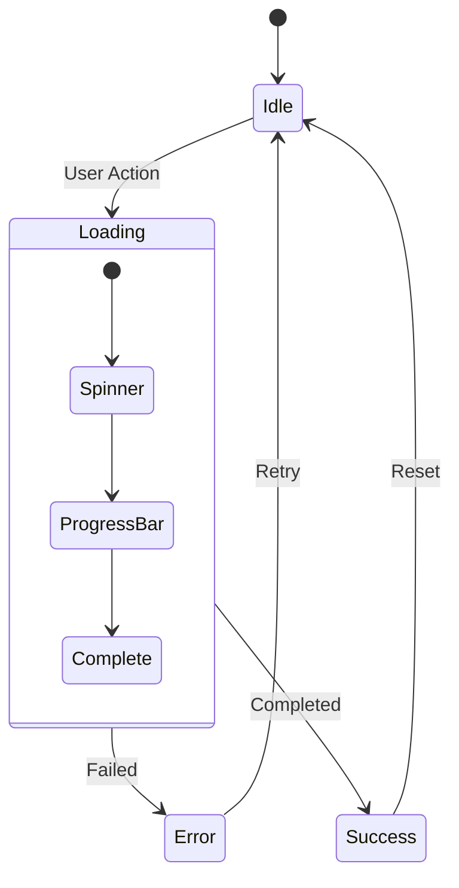
```mermaid
stateDiagram-v2
    [*] --> Idle
    Idle --> Loading: User Action
    Loading --> Error: Failed
    Loading --> Success: Completed
    Error --> Idle: Retry
    Success --> Idle: Reset
    
    state Loading {
        [*] --> Spinner
        Spinner --> ProgressBar
        ProgressBar --> Complete
    }
```

# 7. SECURITY CONSIDERATIONS

## 7.1 AUTHENTICATION AND AUTHORIZATION

### 7.1.1 Authentication Flow

```mermaid
sequenceDiagram
    participant User
    participant Frontend
    participant AuthService
    participant API
    participant Database

    User->>Frontend: Login Request
    Frontend->>AuthService: Authenticate
    AuthService->>Database: Validate Credentials
    Database-->>AuthService: User Data
    AuthService-->>Frontend: JWT + Refresh Token
    Frontend->>API: Request + JWT
    API->>AuthService: Validate Token
    AuthService-->>API: Token Valid
    API-->>Frontend: Protected Resource
```

### 7.1.2 Authorization Matrix

| Role | Requirements Management | Student Data | Reports | System Config |
| --- | --- | --- | --- | --- |
| Admin | Full Access | Full Access | Full Access | Full Access |
| Institution Admin | Own Institution | Own Institution | Own Institution | None |
| Counselor | Read Only | View/Edit | View Only | None |
| Student | Read Only | Own Data Only | None | None |
| Guest | Public Data Only | None | None | None |

### 7.1.3 Token Management

| Token Type | Duration | Refresh Policy | Storage |
| --- | --- | --- | --- |
| Access JWT | 15 minutes | Required after expiry | Memory only |
| Refresh Token | 7 days | Rolling window | HTTP-only cookie |
| API Key | 1 year | Manual rotation | Secure vault |

## 7.2 DATA SECURITY

### 7.2.1 Encryption Strategy

```mermaid
flowchart TD
    A[Data Input] --> B{Sensitivity Level}
    B -->|High| C[Field-Level Encryption]
    B -->|Medium| D[TLS Transport]
    B -->|Low| E[Standard Storage]
    
    C --> F[AWS KMS]
    D --> G[TLS 1.3]
    E --> H[RDS Encryption]
    
    F --> I[Encrypted Storage]
    G --> I
    H --> I
```

### 7.2.2 Data Classification

| Data Type | Classification | Storage Requirements | Access Controls |
| --- | --- | --- | --- |
| Student Records | Highly Sensitive | Encrypted at rest, Field-level encryption | Role-based, Audit logged |
| Transfer Requirements | Sensitive | Encrypted at rest | Role-based |
| Course Catalogs | Public | Standard encryption | Public access |
| System Logs | Internal | Encrypted at rest | Admin only |
| Analytics Data | Internal | Aggregated, Anonymized | Role-based |

### 7.2.3 Backup Security

| Backup Type | Encryption | Storage Location | Retention |
| --- | --- | --- | --- |
| Database | AES-256 | AWS S3 (versioned) | 90 days |
| Documents | AES-256 | AWS Glacier | 7 years |
| Audit Logs | AES-256 | AWS CloudWatch | 2 years |
| Config Files | AES-256 | AWS S3 | 30 days |

## 7.3 SECURITY PROTOCOLS

### 7.3.1 Network Security

```mermaid
flowchart LR
    A[Internet] --> B[WAF]
    B --> C[CloudFront]
    C --> D[ALB]
    D --> E[VPC]
    
    subgraph VPC
        E --> F[Public Subnet]
        F --> G[Private Subnet]
        G --> H[Database Subnet]
    end
```

### 7.3.2 Security Controls

| Control Type | Implementation | Monitoring |
| --- | --- | --- |
| WAF Rules | AWS WAF with custom rules | CloudWatch Metrics |
| DDoS Protection | AWS Shield Standard | Real-time alerts |
| Rate Limiting | API Gateway throttling | CloudWatch Logs |
| IP Filtering | Security group rules | VPC Flow Logs |
| SSL/TLS | ACM managed certificates | Certificate expiry alerts |

### 7.3.3 Security Compliance

| Requirement | Implementation | Validation |
| --- | --- | --- |
| FERPA | Data encryption, Access controls | Annual audit |
| CCPA | Data retention policies, Export capability | Quarterly review |
| SOC 2 | Security controls, Monitoring | External audit |
| PCI DSS | Tokenization, Secure transmission | Automated scans |
| NIST 800-53 | Security controls framework | Continuous monitoring |

### 7.3.4 Incident Response

```mermaid
stateDiagram-v2
    [*] --> Detection
    Detection --> Analysis
    Analysis --> Containment
    Containment --> Eradication
    Eradication --> Recovery
    Recovery --> PostIncident
    PostIncident --> [*]
    
    Analysis --> Escalation
    Escalation --> Containment
```

### 7.3.5 Security Monitoring

| Component | Monitoring Tool | Alert Threshold | Response |
| --- | --- | --- | --- |
| API Gateway | CloudWatch | \>1% error rate | Auto-notification |
| Database | RDS Monitoring | Failed login attempts | Security team alert |
| Application | CloudWatch Logs | Security exceptions | Incident ticket |
| Network | VPC Flow Logs | Suspicious patterns | Auto-block |
| User Activity | Audit Logs | Unusual behavior | Account review |

# 8. INFRASTRUCTURE

## 8.1 DEPLOYMENT ENVIRONMENT

### Primary Environment: AWS Cloud

```mermaid
flowchart TD
    subgraph Production
        A[AWS Cloud] --> B[US-West Region]
        B --> C[Primary VPC]
        B --> D[DR VPC]
        
        subgraph Primary VPC
            E[Public Subnets] --> F[Application Load Balancer]
            G[Private Subnets] --> H[ECS Containers]
            I[Database Subnets] --> J[RDS Multi-AZ]
        end
        
        subgraph DR VPC
            K[Standby Resources]
            L[Cross-Region Replication]
        end
    end
```

| Environment | Purpose | Configuration |
| --- | --- | --- |
| Production | Live system | Multi-AZ, Auto-scaling |
| Staging | Pre-production testing | Single-AZ, Fixed capacity |
| Development | Development testing | Single-AZ, Minimal resources |
| DR | Disaster recovery | Cross-region standby |

## 8.2 CLOUD SERVICES

| Service | Purpose | Configuration |
| --- | --- | --- |
| AWS ECS | Container orchestration | Fargate serverless compute |
| AWS RDS | PostgreSQL database | Multi-AZ, r6g.xlarge instances |
| AWS ElastiCache | Redis caching | Cluster mode enabled |
| AWS S3 | Document storage | Versioning enabled |
| AWS CloudFront | CDN | Edge locations worldwide |
| AWS Route 53 | DNS management | Latency-based routing |
| AWS Certificate Manager | SSL/TLS certificates | Auto-renewal enabled |
| AWS CloudWatch | Monitoring | Enhanced metrics enabled |
| AWS WAF | Web application firewall | Custom rule sets |

## 8.3 CONTAINERIZATION

### Docker Configuration

```mermaid
graph TD
    subgraph Container Architecture
        A[Base Image] --> B[Python 3.11 Alpine]
        B --> C[Django Application]
        B --> D[Celery Workers]
        
        E[Node 18 Alpine] --> F[Next.js Application]
        
        G[Redis Alpine] --> H[Cache Layer]
        
        I[MeiliSearch Official] --> J[Search Engine]
    end
```

| Container | Base Image | Purpose | Resource Limits |
| --- | --- | --- | --- |
| api | python:3.11-alpine | Django REST API | 2 CPU, 4GB RAM |
| worker | python:3.11-alpine | Celery tasks | 2 CPU, 4GB RAM |
| frontend | node:18-alpine | Next.js SSR | 1 CPU, 2GB RAM |
| cache | redis:7-alpine | Caching layer | 1 CPU, 2GB RAM |
| search | getmeili/meilisearch | Search engine | 2 CPU, 4GB RAM |

## 8.4 ORCHESTRATION

### ECS Configuration

```mermaid
flowchart TD
    subgraph ECS Cluster
        A[Application Load Balancer] --> B[Target Groups]
        B --> C[ECS Services]
        
        subgraph Services
            D[API Service]
            E[Worker Service]
            F[Frontend Service]
            G[Search Service]
        end
        
        C --> D
        C --> E
        C --> F
        C --> G
        
        H[Auto Scaling] --> C
        I[Service Discovery] --> C
    end
```

| Service | Tasks | Auto-scaling Policy | Health Check |
| --- | --- | --- | --- |
| API | 4-12 | CPU \> 70% | /health |
| Worker | 2-8 | Queue length \> 1000 | Celery heartbeat |
| Frontend | 2-6 | Request count \> 1000/min | / |
| Search | 2 | Fixed | /health |

## 8.5 CI/CD PIPELINE

```mermaid
flowchart LR
    A[GitHub Repository] --> B[GitHub Actions]
    B --> C{Tests Pass?}
    C -->|Yes| D[Build Images]
    C -->|No| E[Notify Team]
    D --> F[Push to ECR]
    F --> G{Environment}
    G -->|Staging| H[Deploy to Staging]
    G -->|Production| I[Deploy to Production]
    H --> J[Integration Tests]
    J -->|Pass| I
    J -->|Fail| E
```

### Pipeline Stages

| Stage | Tools | Actions | Success Criteria |
| --- | --- | --- | --- |
| Code Quality | ESLint, Black | Style checking, linting | No violations |
| Testing | Jest, PyTest | Unit/integration tests | 90% coverage |
| Security | OWASP ZAP, Snyk | Security scanning | No high vulnerabilities |
| Build | Docker | Image creation | Successful build |
| Deploy | AWS CDK | Infrastructure updates | Health checks pass |
| Monitoring | CloudWatch | Performance metrics | Within thresholds |

### Deployment Strategy

| Environment | Strategy | Rollback Plan |
| --- | --- | --- |
| Staging | Blue/Green | Automatic |
| Production | Rolling update | Manual approval |
| DR | Pilot light | Automated failover |

# APPENDICES

## A.1 ADDITIONAL TECHNICAL INFORMATION

### A.1.1 Database Sharding Strategy

```mermaid
flowchart TD
    A[Application] --> B{Shard Router}
    B --> C[Shard 1: Current Year]
    B --> D[Shard 2: Previous Year]
    B --> E[Shard 3: Archive]
    
    C --> F[(Primary DB)]
    C --> G[(Read Replica)]
    
    D --> H[(Primary DB)]
    D --> I[(Read Replica)]
    
    E --> J[(Archive DB)]
```

### A.1.2 Cache Invalidation Matrix

| Cache Type | Invalidation Trigger | Strategy | TTL |
| --- | --- | --- | --- |
| Course Data | Requirement Update | Tag-based | 24 hours |
| Search Index | Data Change | Immediate | N/A |
| User Sessions | Inactivity | Time-based | 30 minutes |
| API Responses | Data Update | Pattern-based | 1 hour |
| Static Assets | Deployment | Version-based | 7 days |

## A.2 GLOSSARY

| Term | Definition |
| --- | --- |
| Articulation Agreement | Formal document defining course equivalencies between institutions |
| Course Attribute | Specific characteristic of a course affecting its transferability |
| Degree Audit | Process of evaluating completed courses against transfer requirements |
| Equivalency Chain | Series of course equivalencies across multiple institutions |
| Major Preparation | Required lower-division coursework for specific transfer majors |
| Prerequisite Map | Visual representation of course prerequisite relationships |
| Transfer Pattern | Common sequence of courses leading to successful transfer |
| Unit Articulation | Process of converting course units between institutions |
| Validation Rule | Criterion for verifying course transferability |
| Version Control | System for managing requirement changes across academic years |

## A.3 ACRONYMS

| Acronym | Full Form |
| --- | --- |
| ACID | Atomicity, Consistency, Isolation, Durability |
| ALB | Application Load Balancer |
| API | Application Programming Interface |
| AWS | Amazon Web Services |
| CDN | Content Delivery Network |
| CORS | Cross-Origin Resource Sharing |
| CSP | Content Security Policy |
| DRF | Django REST Framework |
| ECS | Elastic Container Service |
| FERPA | Family Educational Rights and Privacy Act |
| IGETC | Intersegmental General Education Transfer Curriculum |
| JWT | JSON Web Token |
| KMS | Key Management Service |
| RBAC | Role-Based Access Control |
| RDS | Relational Database Service |
| REST | Representational State Transfer |
| S3 | Simple Storage Service |
| SES | Simple Email Service |
| SSO | Single Sign-On |
| SSR | Server-Side Rendering |
| TLS | Transport Layer Security |
| VPC | Virtual Private Cloud |
| WAF | Web Application Firewall |
| WCAG | Web Content Accessibility Guidelines |

## A.4 SYSTEM MONITORING METRICS

```mermaid
flowchart LR
    A[CloudWatch] --> B{Metric Types}
    B --> C[Infrastructure]
    B --> D[Application]
    B --> E[Business]
    
    C --> F[CPU/Memory]
    C --> G[Network]
    C --> H[Disk]
    
    D --> I[Response Time]
    D --> J[Error Rates]
    D --> K[Cache Hits]
    
    E --> L[User Activity]
    E --> M[Validations]
    E --> N[Transfers]
```

### A.4.1 Alert Thresholds

| Metric | Warning Threshold | Critical Threshold | Action |
| --- | --- | --- | --- |
| CPU Utilization | 70% | 85% | Auto-scale |
| Memory Usage | 75% | 90% | Alert DevOps |
| API Latency | 400ms | 800ms | Circuit break |
| Error Rate | 1% | 5% | Page SRE |
| Cache Miss Rate | 20% | 40% | Optimize cache |
| Disk Usage | 75% | 90% | Expand storage |